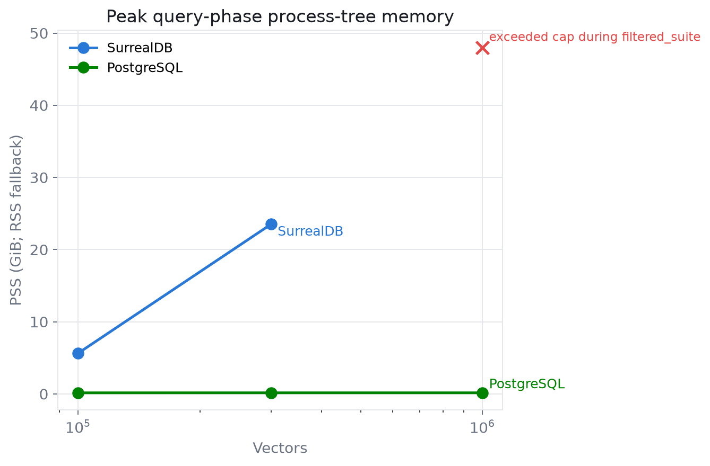
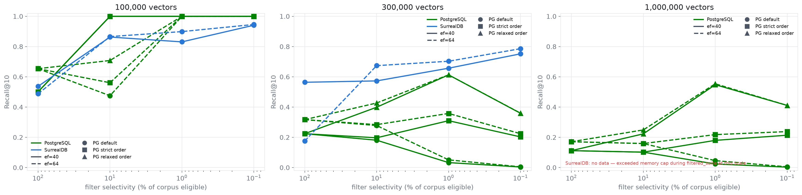
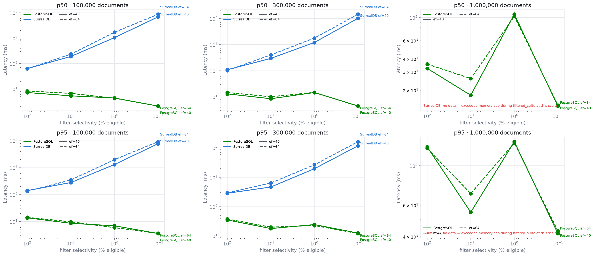

# ⚠️ AI-GENERATED · UNVERIFIED

**Everything here — code, results, charts — was written by AI agents and has not been reviewed by a human. Reproduce before you trust it.**

---

# filtered-vector-bench

Vector-search benchmarks usually measure unfiltered ANN. Real applications almost always
filter—by tenant, user, permission scope, or category—and *filtered* ANN is where engines
differ most: pre- vs post-filtering, predicate pushdown, selectivity behavior, and memory under
load.

This project runs an identical, configurable filtered-vector, full-text, and hybrid RRF workload
against multiple engines
on the same machine, with the same data, queries, and exact ground truth. It reports recall,
latency, underfill, memory, cold-start, and load behavior as curves across a scale ladder.
Currently supported engines are SurrealDB (HNSW + BM25) and PostgreSQL + pgvector
(HNSW + `tsvector`/GIN). The harness
is engine-extensible by design: one adapter file per engine.

## Quickstart

Requirements are Python 3.11+, `uv`, Docker with at least 4 GiB available, and Linux for full
RSS/PSS accounting. The smoke workload uses 5,000 64-dimensional vectors and normally completes
in a few minutes. From the directory containing your checkout, run:

```bash
cd filtered-vector-bench
uv sync
uv run python scripts/run.py --config configs/smoke.yaml --engine all --out results/smoke
uv run python scripts/report.py --results results/smoke
```

For a serious run, edit the memory cap and engine modes in `configs/default.yaml`, stop unrelated
services, and run the same commands with that config. `configs/full.yaml` adds 3M and 10M rungs;
the 10M × 1024 corpus alone is about 38 GiB as float32 and needs at least 64 GiB RAM plus ample
disk. Results are appended as JSONL/CSV while a cell runs, so completed cells survive failures.

Binary mode downloads SurrealDB `v3.2.1`, verifies its pinned SHA-256 checksum, and caches it.
The built-in binary downloader targets Linux x86-64; use Docker or supply `engines.surrealdb.binary`
on other platforms.
Local PostgreSQL mode expects `initdb` and `postgres` on `PATH` with pgvector available.
Docker mode uses the pinned images in `docker/docker-compose.yml` and gives each cell an isolated
container and volume.

## What a run does

Each `(engine, dimensions, document count)` cell generates or reuses deterministic memory-mapped
data and exact eligible-subset ground truth. When text is enabled, every embedding cluster also
gets deterministic topic documents and aligned text queries. The runner loads, settles, performs
the vector suite's two cold restarts when selected, then runs selected vector, FTS, and
single-statement hybrid suites in that order,
optionally applies churn, and collects disk, plan, latency, recall/nDCG, underfill, and process-tree
memory data. A missing expected index node
in `EXPLAIN` is recorded prominently but does not suppress the measurement. A process killed at
the configured memory cap becomes an `exceeded_memory_cap` result and does not abort later cells.
Generated NumPy data lives in ignored `data/`; disposable engine stores and downloaded binaries
live in ignored `.cache/`. Result directories therefore contain only portable measurements and
reports, not database files.

See [FAIRNESS.md](FAIRNESS.md) before interpreting comparisons. In particular, an engine's
idiomatic query can imply different filtered-ANN semantics; recall and underfill make that visible.

## Sample charts

`scripts/report.py` writes PNG and SVG charts plus `summary.md` beneath the result directory:

- recall@10, p50/p95 latency, and underfill versus selectivity
- FTS and hybrid p50/p95 latency versus selectivity
- FTS/hybrid nDCG@10 versus selectivity in paired panels
- peak query memory, restart-to-first-query, load rate, and time-to-queryable versus scale
- when enabled, churn memory and pre/post recall delta

No sample measurements are checked in: charts must identify the machine, exact config, and engine
versions that produced them.

## Configuration

YAML is validated strictly. Scale, dimension, selectivity, EF, query count, cluster distribution,
batching, timeout, memory cap, settle duration, pgvector modes, and churn are configurable. A
selectivity of `1.0` is unfiltered; other values receive deterministic tenant labels with the
requested corpus frequency. The run metadata contains the normalized config and SHA-256 hash.

PostgreSQL modes map to pgvector's `hnsw.iterative_scan`: `default` disables it,
`strict_order` preserves exact ordering, and `relaxed_order` permits relaxed ordering. SurrealDB
has one documented query mode. Engine HNSW construction parameters remain at each engine's
defaults and are captured in metadata.

The optional `text` mapping controls `enabled`, hybrid candidate depth (`fts_candidates`), and the
RRF smoothing constant (`rrf_k`). Topic and background vocabulary sizes default to 60 and 2,000;
the smoke config deliberately uses smaller vocabularies. Omitting `text` preserves the original
vector-only workload and schema.

The optional `suites` mapping selects `vector`, `fts`, and `hybrid` independently and defaults all
three to true. `query_topics` defaults to `global`; `tenant_present` creates per-tier text/vector
queries only from topics with at least `ceil(3 × K)` relevant rows in that tier. The normalized
selection and construction mode are recorded in metadata and cell events.

`measurement_state` defaults to `fresh`, preserving the fixed post-load settle behavior. In
`steady` state, the runner waits for twelve consecutive 10-second process-tree RSS and data-dir
disk observations with less than 1% change (up to 45 minutes), runs PostgreSQL ANALYZE and waits
for autovacuum workers, cleanly restarts the engine, records that cold open, and discards one full
warm-up pass before recording the normal suites. Reports label the state and can compare result
directories with `scripts/report.py --compare <other-results>`.

## Add an engine

1. Add `fvb/engines/<name>.py` implementing `Engine` from `fvb/engines/base.py`.
2. Keep lifecycle and storage inside the per-cell work directory. Honor the supplied timeout and
   memory cap, return stable integer source IDs, and expose the root process IDs for sampling.
3. Implement `explain()` and a conservative `plan_uses_index()` gate.
4. Register the adapter in `fvb/runner.py`, add its fixed chart color in `fvb/report.py`, document
   parity choices in `FAIRNESS.md`, and add it to the smoke workflow.

Contributions should preserve deterministic inputs, raw results, and failure-as-data behavior.

## Sample results

Runs of the full matrix (100k / 300k / 1M × 1024-dim, cosine, vector + full-text + hybrid
suites, fresh and steady measurement states) on a 16-core / 125 GiB Linux machine, July 2026.
Engines: SurrealDB v3.2.1 (RocksDB backend), PostgreSQL 17.10 + pgvector 0.8.3, both at their
own defaults. Full tables: [docs/sample-results/summary.md](docs/sample-results/summary.md);
raw JSONL/CSV evidence ships with each result directory. Read [FAIRNESS.md](FAIRNESS.md)
before quoting anything.







Highlights:

- **At 1M vectors, every SurrealDB retrieval mode exceeded the 48 GiB memory cap under
  sustained querying** — filtered vector KNN (EXPLAIN-verified index plan in effect), the
  single-statement hybrid, and eventually even the full-text-only suite. This reproduces in
  both fresh and steady (quiesced, restarted, warmed) states, so it is not compaction debt.
  At 100k and 300k all SurrealDB suites complete, with generally stronger unfiltered vector
  recall than pgvector at equal ef.
- **SurrealDB's narrow-filter vector latency is intrinsic**: ~10-15 s at 0.1% selectivity at
  300k, essentially unchanged by steady state. Its filtered full-text shows no such
  selectivity pathology (latency flat as filters narrow) but costs ~0.5-1.1 s at 1M and
  accumulates query-path memory.
- **PostgreSQL completed every cell** in single-digit GiB with ~10 ms cold starts. Its
  weaknesses are visible too: at server-default settings the planner keeps the HNSW plan at
  every selectivity, so narrow-filter vector recall collapses (the classic post-filter
  problem); under tuned memory settings it instead switches to a B-tree + exact plan with
  perfect recall — filtered recall is configuration-sensitive. Raw unfiltered HNSW recall at
  default build parameters is mediocre on this deliberately hard corpus.
- **Hybrid (vector + text + RRF, one statement per engine)**: PostgreSQL 8-103 ms across all
  scales and tiers; SurrealDB ~100 ms to ~15 s at 300k (tracking its vector branch) and
  memory-cap death at 1M. Text ranking quality (nDCG vs constructed relevance) was
  statistically tied between engines at every completed tier.
- **Fresh vs steady deltas are measured and reported**: compaction debt inflates fresh
  latencies (up to ~2x on unfiltered SurrealDB FTS at 300k, ~10-60% on many PostgreSQL
  cells) but explains none of the scale failures.
